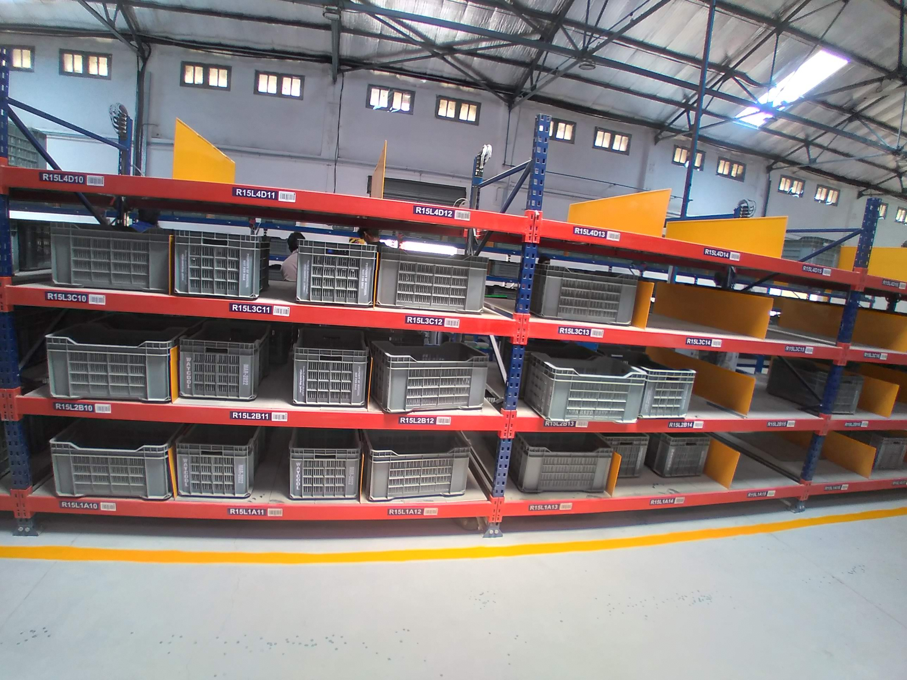

# material_movement

Describing material movement empty rack allotment

## Collection - rack_master_table

We used this collection to identify rack availability and get empty rack.

### Model structure

Created all available rack entries in rack_master_table collection in following way:

```json
{
  "plant_id": "XYZ",
  "unit_no": 1,    //(multiple unit 1,2,3,4)
  "rack_id": "R1",  //(multiple rack as R1, R2, R3)
  "level_id": "L1",   // (multiple level)
  "column_id": "A1",   //(multiple column A,B,C)
  "location_id": "R1L1A1",
  "status": "unoccupied"   //(either occupied or unoccupied)
}
```


### Query to get first empty rack

Due to status unoccupied and sort order, it will always return empty and in order:

```javascript
rack_master_table.find({
    plant_id: 1,
    status: "unoccupied"
})
.sort({ rack_id: 1, unit_id: 1, location_id: 1})
.collation({local:"en_US",numericOrdering:true})
.limit(1);
```

## Collection name - primary_storage

After allotting empty rack in above order the fork lift user will go at that location and there is bar code on each rack so user will scan that and place the pallet there and update in application which make status of that rack in rack_master_table "occupied".

### Primary_storage collection structure

This collection has specific SKU/ITEM detail with stock and unit of measurement:
rack allotment is irrespective of material, keeping all material as it comes 
Primary_storage collection have detail of each material stacked

```json
{
  "plant_id": "1023",
  "unit_no": 1,
  "rack_id": "R1",
  "level_id": "L1",
  "column_id": "A1",
  "location_id": "R1L1A1",
  "material_code": "WC0001000102420664",
  "material_name": "MDM PONNI BOILD RICE DLXBULK PCK 25kg",
  "carrier_count": 20,
  "total_stock": 500, // 25 * 20
  "uom": "PAC",
  "pallet_barcode": "PLT1111",
  "created_date": ""
}
```

## Rack condition

```
UNIT 1                   UNIT 2                                   UNIT 3
R1L2B1  R1L2B2  R1L2B3   R1L2B4   R1L2B5  R1L2B6     R1L2B4   R1L2B5  R1L2B6 
R1L1A1  R1L1A2  R1L1A3   R1L1A4   R1L1A5  R1L1A6     R1L1A7    R1L1A8  R1L1A9
```

### Sort order explanation

`.sort({ rack_id: 1, unit_id: 1, location_id: 1})` - this sort order will always pick rack from UNIT1 first and then in order.

So it will be like:
R1L1A1, R1L1A2, R1L1A3, R1L2B1, R1L2B2, R1L2B3, R1L1A4, R1L1A5, R1L1A6 and so on…

## ex rack image 



